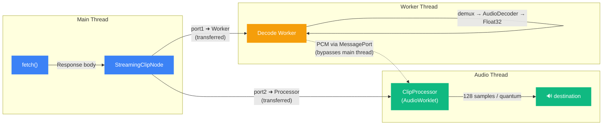

# @jadujoel/web-audio-clip-node

AudioWorklet clip playback for the Web Audio API with pause/resume, reusable start, buffer hot-swap, loop callbacks, loop crossfade, real-time sample playhead control, and sample-accurate fades — without extra nodes.

Live demo: https://jadujoel.github.io/web-audio-clip-node/

## At a Glance

- Use `ClipNode` when your audio is already in an `AudioBuffer`.
- Use `Coordinator` + `StreamingClipNode` to start playback before full download.
- Use `@jadujoel/web-audio-clip-node/react` for hooks and ready-made transport/UI controls.

## Why this library

`AudioBufferSourceNode` is good at one-shot playback, but it does not give you some things more advanced apps usually need:

- **Real-time playhead** get/set access in samples
- **Pause and resume** — `AudioBufferSourceNode` has no pause; you must stop and recreate, or set playbackrate to zero and back, which is awkward.
- **Reusable start** — call `start()` again after `stop()` without creating a new node
- **Buffer hot-swap** — assign a new `AudioBuffer` to a playing node and it switches seamlessly
- **Loop callback** when the playhead wraps (`onlooped`)
- **Loop crossfade** built into the source itself
- **Sample-accurate fade in / fade out** without wiring extra gain nodes around every source
- **Streaming** — start playback before the full file has been fetched, via `StreamingClipNode`

`ClipNode` is aimed at those missing pieces while staying small enough to drop into a plain browser app.

## Install

```sh
npm install @jadujoel/web-audio-clip-node
```

```sh
pnpm add @jadujoel/web-audio-clip-node
```

```sh
yarn add @jadujoel/web-audio-clip-node
```

```sh
bun install @jadujoel/web-audio-clip-node
```

> **Tip:** Use **Ogg Opus** encoded at **48 kHz** for best performance, and set audio context to same sample rate. Matching the source sample rate avoids resampling overhead on decode.

## Quick Start

```ts
import { ClipNode, getProcessorBlobUrl } from "@jadujoel/web-audio-clip-node";

const ctx = new AudioContext();
await ctx.audioWorklet.addModule(getProcessorBlobUrl());

const clip = new ClipNode(ctx);
clip.connect(ctx.destination);

const response = await fetch("/audio/clip.opus");
const buffer = await ctx.decodeAudioData(await response.arrayBuffer());

clip.buffer = buffer;
clip.loop = true;
clip.loopStart = 0.5;   // seconds
clip.loopEnd = 1.75;    // seconds
clip.loopCrossfade = 0.04;
clip.fadeIn = 0.01;
clip.fadeOut = 0.08;
clip.onlooped = () => {
  console.log("looped at sample", clip.playhead);
};

clip.playbackRate.value = 1;
clip.playhead = 24_000; // seek to sample 24,000 before starting
clip.start();
```

`clip.playhead` is read and written in samples, so you can scrub to an exact frame position while playback is active.

## Streaming Quick Start

Use `Coordinator` to share a single worklet module load and create `StreamingClipNode` instances that start playback before the full file has been fetched.

Streaming decode uses WebCodecs (`AudioDecoder`) in a worker, so browser support for WebCodecs + AudioWorklet is required.

```ts
import { Coordinator } from "@jadujoel/web-audio-clip-node";

const ctx = new AudioContext({ sampleRate: 48_000 });
const coordinator = Coordinator.fromContext(ctx);
await coordinator.addModule(); // loads the worklet once

const clip = coordinator.createStreamingClipNode();
clip.connect(ctx.destination);

clip.onprogress = ({ bytesReceived }) => console.log("received", bytesReceived, "bytes");
clip.ondone = () => console.log("stream complete");
clip.onerror = ({ error }) => console.error("stream error:", error.message);

// Setting the URL immediately begins fetching and decoding.
// Playback starts automatically once the first chunk is decoded.
clip.url = "/audio/clip.opus";
clip.start();
```

Optional: reduce worker-to-worklet transport memory with int16 chunks:

```ts
const clip = coordinator.createStreamingClipNode(undefined, {
  useInt16: true,
});
```

Tradeoffs:
- `useInt16: true` roughly halves PCM chunk transfer size and can reduce peak memory pressure on mobile.
- PCM data is quantized to 16-bit before transfer, so very low-level detail is slightly reduced compared to float32 transport.
- Default behavior stays float32 when `useInt16` is omitted.

See [examples/coordinator-streaming](examples/coordinator-streaming/) and [examples/cdn-opus-streaming](examples/cdn-opus-streaming/) for full working examples.

## React Quick Start

```tsx
import { useClipNode, useClipControls, TransportButtons } from "@jadujoel/web-audio-clip-node/react";
import "@jadujoel/web-audio-clip-node/styles.css";

function Player() {
  const controls = useClipControls();
  const clip = useClipNode({
    values: controls.values,
    enabled: controls.enabled,
    loop: controls.loop,
    setValue: controls.setValue,
  });

  return (
    <TransportButtons
      nodeState={clip.nodeState}
      onStart={clip.start}
      onStop={clip.stop}
      onPause={clip.pause}
      onResume={clip.resume}
      onDispose={clip.dispose}
      onLog={clip.logState}
      onLoadSound={clip.loadSound}
    />
  );
}
```

Additional ready-made controls (`GainControl`, `PlaybackRateControl`, and others) are available from the same `react` entry point. See [examples/playground](examples/playground/) for a full wired-up example.

## CDN Usage

Use the bundled entry point when you want a single browser import and load the processor from jsDelivr with `getProcessorCdnUrl()`.

```html
<script type="module">
  import { ClipNode, getProcessorCdnUrl } from "https://cdn.jsdelivr.net/npm/@jadujoel/web-audio-clip-node/bundle";

  const ctx = new AudioContext();
  await ctx.audioWorklet.addModule(getProcessorCdnUrl());

  const clip = new ClipNode(ctx);
  clip.connect(ctx.destination);
  clip.buffer = await ctx.decodeAudioData(await fetch("https://jadujoel.github.io/web-audio-clip-node/sounds/example.opus").then(r => r.arrayBuffer()));
  clip.start();
</script>
```

Full no-bundler demos: [examples/cdn-vanilla](examples/cdn-vanilla/) and [examples/cdn-opus-streaming](examples/cdn-opus-streaming/).

## Features

- AudioWorklet-based clip playback with explicit transport control
- **Pause / resume** and **reusable start** — no need to recreate the node after stopping
- **Buffer hot-swap** — assign `clip.buffer` on a live node and it switches immediately
- Loop start, loop end, loop crossfade, and `loopMode` (`"forward"` | `"boomerang"`)
- Real-time playhead readback and sample-accurate seeking via `clip.playhead`
- Sample-accurate fade in and fade out without external helper nodes
- Playback rate from `-2` to `2`
- Detune, gain, stereo pan, highpass, and lowpass controls
- **Streaming** — `StreamingClipNode` fetches and decodes incrementally; playback starts on the first decoded chunk
- Optional React hooks and ready-made controls

## Performance

`StreamingClipNode` uses a **three-thread architecture** so that decoding and playback never block the main thread:



1. **Main thread** starts a `fetch()` and hands the response stream to a dedicated **Worker**.
2. The **Worker** demuxes the container (Ogg, WebM, MP4, ADTS, …), feeds frames into the platform `AudioDecoder`, resamples if needed, and posts the decoded Float32 PCM through a **transferred `MessagePort`**.
3. The **AudioWorklet processor** receives samples directly from the worker — the main thread is never in the hot path. Playback begins as soon as the first chunk lands.

Because the `MessagePort` is transferred to both ends, decoded audio travels **Worker → Processor** without touching the main thread, keeping UI jank at zero even while decoding large files.

> **Tip:** Use **Ogg Opus at 48 kHz** and create your `AudioContext` at the same rate. Matching sample rates avoids resampling in the decode worker, giving the lowest possible latency from fetch to first audible sample.

## Lifecycle Callbacks

`ClipNode` exposes callbacks for every state transition:

| Callback | Fired when |
|----------|------------|
| `onscheduled` | `start(when)` is called with a future timestamp |
| `onstarted` | playback begins |
| `onpaused` | `pause()` takes effect |
| `onresumed` | `resume()` takes effect |
| `onlooped` | the playhead wraps (loop) |
| `onstopped` | `stop()` takes effect |
| `onended` | the clip plays to its natural end (non-looping) |
| `ondisposed` | `dispose()` is called |
| `onstatechange` | any of the above — receives the new `ClipNodeState` |

`ClipNode.timesLooped` tracks the total wrap count since the last `start()`. `ClipNode.state` holds the current `ClipNodeState` string.

For per-render-quantum telemetry, assign `clip.onframe` to receive a `FrameData` object every audio block. Enabling `onframe` also populates `clip.cpu` with the processor's CPU usage estimate.

## Event Listeners

Every event has two equivalent ways to subscribe: a callback property (`clip.onended = fn`) and `clip.events.addEventListener()` / `clip.events.removeEventListener()`. Use the property form when you have a single handler and only need to remove it by nulling it out. Use the `events` API when you need multiple independent subscribers or want a structured teardown path.

```ts
// Callback property — simple, one at a time
clip.onended = () => advancePlaylist();

// addEventListener — multiple handlers, clean unsubscribe
const handler = () => advancePlaylist();
clip.events.addEventListener("ended", handler);
// later:
clip.events.removeEventListener("ended", handler);
```

### ClipNode Event Listener Examples

**`ended` — auto-advance a playlist**

Fires once when a non-looping clip plays to its natural end. Use it to load the next track, update a playlist cursor, or trigger UI cleanup.

```ts
clip.events.addEventListener("ended", () => {
  playlistIndex = (playlistIndex + 1) % playlist.length;
  loadAndPlay(playlist[playlistIndex]);
});
```

**`looped` — react to each wrap**

Fires every time the playhead crosses the loop boundary. Use it to increment a loop counter, randomise loop parameters, or sync visuals to the loop beat.

```ts
clip.events.addEventListener("looped", () => {
  loopCount++;
  if (loopCount % 4 === 0) {
    // change timbre every 4 loops
    clip.buffer = alternateBuffer;
  }
});
```

**`statechange` — drive a single state machine**

Receives the new `ClipNodeState` string on every transition (`"initial"` → `"scheduled"` → `"started"` → `"paused"` → …). A single handler here is cleaner than wiring many individual callbacks when you only need to update UI.

```ts
clip.events.addEventListener("statechange", ({ state }) => {
  playButton.textContent = state === "started" ? "Pause" : "Play";
  statusBadge.dataset.state = state;
});
```

**`paused` and `resumed` — sync transport UI**

Use these when your UI tracks the `paused` / `playing` distinction separately from `stopped`.

```ts
clip.events.addEventListener("paused",  () => playIcon.classList.add("paused"));
clip.events.addEventListener("resumed", () => playIcon.classList.remove("paused"));
```

**`timeupdate` — scrubber and clock display**

Fires at most every 250 ms (configurable via `clip.timeUpdateInterval`) with the current `AudioContext.currentTime`. Use it to move a scrubber thumb or update a running-time label without subscribing to every audio quantum.

```ts
clip.events.addEventListener("timeupdate", ({ currentTime }) => {
  const pct = (clip.playhead / clip.buffer!.length) * 100;
  scrubber.style.left = `${pct}%`;
  timeLabel.textContent = currentTime.toFixed(2);
});
```

**`seeking` and `seeked` — show a seek indicator**

`seeking` fires the moment you write to `clip.playhead`; `seeked` fires once the worklet confirms the new position. Show a spinner or freeze the scrubber between the two.

```ts
clip.events.addEventListener("seeking", () => scrubber.classList.add("seeking"));
clip.events.addEventListener("seeked",  () => scrubber.classList.remove("seeking"));
```

**`durationchange` — update metadata when the buffer changes**

Fires when a new `AudioBuffer` is assigned to a live node. Use it to recalculate UI elements that depend on total duration.

```ts
clip.events.addEventListener("durationchange", ({ duration }) => {
  const seconds = duration / ctx.sampleRate;
  durationLabel.textContent = `${seconds.toFixed(2)} s`;
});
```

**`ratechange` — reflect playback speed in the UI**

Fires whenever `clip.playbackRate.value` changes. Useful to keep a rate display in sync when rate is changed programmatically from somewhere else in your code.

```ts
clip.events.addEventListener("ratechange", ({ rate }) => {
  rateDisplay.textContent = `${rate.toFixed(2)}×`;
});
```

**`frame` — per-quantum telemetry (VU meter, CPU)**

Fires once per 128-sample audio block (≈2.67 ms at 48 kHz) with a `[currentTime, currentFrame, playhead, timeTaken]` tuple. Only enable this when you actually need it — it adds a cross-thread message every quantum.

```ts
clip.events.addEventListener("frame", ({ data: [currentTime, currentFrame, playhead, timeTaken] }) => {
  vuMeter.level = playhead / clip.buffer!.length;
  cpuLabel.textContent = `${(clip.cpu * 100).toFixed(1)} %`;
});
```

**`disposed` — clean up external resources**

Fires when `clip.dispose()` is called. Use it to release object URLs, remove DOM elements, or unregister the node from a pool.

```ts
clip.events.addEventListener("disposed", () => {
  URL.revokeObjectURL(objectUrl);
  container.remove();
});
```

---

### StreamingClipNode Event Listener Examples

`StreamingClipNode` emits all `ClipNode` events plus the streaming-specific ones below.

**`loadstart` — show a loading indicator**

Fires as soon as `clip.url` is set and the fetch begins. Show a spinner or skeleton so the user knows something is happening.

```ts
clip.events.addEventListener("loadstart", () => {
  spinner.hidden = false;
  errorBanner.hidden = true;
});
```

**`progress` — loading bar**

Fires each time a chunk arrives, with the cumulative bytes received. Use it to fill a download progress bar. If the server returns a `Content-Length` header you can compute a percentage; otherwise show an indeterminate bar and display raw bytes.

```ts
clip.events.addEventListener("progress", ({ bytesReceived }) => {
  // If total size is known:
  if (totalBytes > 0) {
    progressBar.value = bytesReceived / totalBytes;
  }
  bytesLabel.textContent = `${(bytesReceived / 1024).toFixed(0)} KB`;
});
```

**`canplay` — enable the play button**

Fires once the first chunk has been decoded and enough samples are buffered that playback can start immediately. Enable playback controls here — `clip.start()` is safe to call from this point onwards.

```ts
clip.events.addEventListener("canplay", () => {
  spinner.hidden = true;
  playButton.disabled = false;
});
```

**`canplaythrough` — signal stutter-free playback**

Fires when the decoder estimates that the remaining data will arrive fast enough to play through without rebuffering. Use it to hide the "Still loading…" notice or start auto-play if the user hasn't interacted yet.

```ts
clip.events.addEventListener("canplaythrough", () => {
  bufferingNotice.hidden = true;
});
```

**`waiting` — rebuffering stall**

Fires when the playhead catches up with the decoded buffer and playback stalls waiting for more data. Show a rebuffering indicator so the user knows the pause is not intentional.

```ts
clip.events.addEventListener("waiting", () => {
  rebufferingBadge.hidden = false;
});

clip.events.addEventListener("canplay", () => {
  rebufferingBadge.hidden = true; // reuse canplay to hide it again
});
```

**`done` — fetch and decode complete**

Fires once the entire stream has been received and decoded successfully. Use it to hide download progress UI, enable "download" buttons, or transition a stream-only player into a seek-anywhere mode.

```ts
clip.events.addEventListener("done", () => {
  progressBar.hidden = true;
  downloadButton.disabled = false;
  seekBar.classList.add("fully-buffered");
});
```

**`error` — handle stream failures gracefully**

Fires if the fetch or decoder encounters a fatal error. Show an error message and offer a retry action.

```ts
clip.events.addEventListener("error", ({ error }) => {
  console.error("Stream failed:", error);
  errorMessage.textContent = `Playback error: ${error.message}`;
  retryButton.hidden = false;
});
```

**`retry` — surface transient network retries**

Fires before each automatic retry attempt with the attempt number, back-off delay (ms), and the triggering error string. Use it to show a non-blocking "Reconnecting…" toast.

```ts
clip.events.addEventListener("retry", ({ attempt, delay, error }) => {
  toast.show(`Network issue, retrying in ${(delay / 1000).toFixed(1)} s… (${error})`);
});
```

**`metadata` — display stream info**

Fires as soon as the container headers are parsed, before any audio has been decoded. Use it to show codec, sample rate, and channel count metadata while the rest of the file is still downloading.

```ts
clip.events.addEventListener("metadata", ({ metadata }) => {
  infoPanel.textContent =
    `${metadata.codec} · ${metadata.sampleRate} Hz · ${metadata.channels} ch`;
});
```

**`bufferchange` — draw buffer ranges**

Fires whenever the set of decoded ranges changes. Use it to render a buffering bar similar to a `<video>` element's `.buffered` ranges — grey for downloaded, coloured for the current position.

```ts
clip.events.addEventListener("bufferchange", ({ buffered }) => {
  renderBufferRanges(seekBar, buffered, clip.duration);
});

function renderBufferRanges(
  bar: HTMLElement,
  ranges: { start: number; end: number }[],
  total: number,
) {
  bar.querySelectorAll(".range").forEach((el) => el.remove());
  for (const { start, end } of ranges) {
    const div = document.createElement("div");
    div.className = "range";
    div.style.left  = `${(start / total) * 100}%`;
    div.style.width = `${((end - start) / total) * 100}%`;
    bar.appendChild(div);
  }
}
```

**`readystatechange` — coarse loading state**

Fires with one of `"have-nothing"`, `"have-metadata"`, `"have-current-data"`, `"have-future-data"`, or `"have-enough-data"` — mirroring the HTML media element ready-state model. Useful when you want a single place to drive a multi-phase loading UI.

```ts
clip.events.addEventListener("readystatechange", ({ state }) => {
  loadingLabel.textContent = {
    "have-nothing":       "Waiting…",
    "have-metadata":      "Loading metadata",
    "have-current-data":  "First chunk ready",
    "have-future-data":   "Buffering…",
    "have-enough-data":   "Ready",
  }[state] ?? state;
});
```

## Processor Loading Options

| Method | Function | Use case |
|--------|----------|----------|
| Blob URL | `getProcessorBlobUrl()` | Default for package consumers — zero setup |
| CDN | `getProcessorCdnUrl("latest")` | Plain browser usage via jsDelivr |
| Self-hosted | `getProcessorModuleUrl(baseUrl)` | You serve `clip-processor.bundle.js` from your own server |

## Entry Points

| Entry point | Import path | Contents |
|-------------|-------------|----------|
| Core | `@jadujoel/web-audio-clip-node` | `ClipNode`, `Coordinator`, `StreamingClipNode`, types, utilities, controls, processor kernel |
| Bundle | `@jadujoel/web-audio-clip-node/bundle` | Single-file ESM bundle for CDN or browser module usage |
| React | `@jadujoel/web-audio-clip-node/react` | Store, hooks, and UI components |
| Streaming | `@jadujoel/web-audio-clip-node/streaming` | Streaming helpers (worker factories, stream-format detection) |
| Processor | `@jadujoel/web-audio-clip-node/processor` | Standalone worklet script |
| Styles | `@jadujoel/web-audio-clip-node/styles.css` | CSS for the React components |

## Examples

The [examples](examples/) directory covers the main integration styles. Run all of them locally with `bun run examples` from the repo root.

| Example | Description | Build step? |
|---------|-------------|-------------|
| [cdn-vanilla](examples/cdn-vanilla/) | Single HTML file using the CDN bundle and processor URL | No |
| [cdn-opus-streaming](examples/cdn-opus-streaming/) | Single HTML file streaming Ogg Opus via CDN imports | No |
| [coordinator-streaming](examples/coordinator-streaming/) | Bundler app using `Coordinator` + `StreamingClipNode` | Yes |
| [esm-bundler](examples/esm-bundler/) | Vite + TypeScript app importing the package directly | Yes |
| [streaming](examples/streaming/) | Low-level streaming example with a custom decode worker | Yes |
| [playground](examples/playground/) | Interactive UI with all controls wired up | Yes |

## License

MIT
