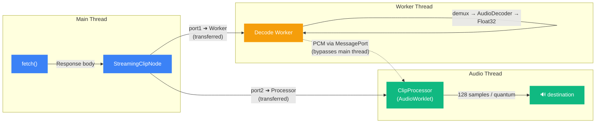

# @jadujoel/web-audio-clip-node

AudioWorklet clip playback for the Web Audio API with pause/resume, reusable start, buffer hot-swap, loop callbacks, loop crossfade, real-time sample playhead control, and sample-accurate fades — without extra nodes.

Live demo: https://jadujoel.github.io/web-audio-clip-node/

## Why this library

`AudioBufferSourceNode` is good at one-shot playback, but it does not give you some things more advanced apps usually need:

- **Real-time playhead** get/set access in samples
- **Pause and resume** — `AudioBufferSourceNode` has no pause; you must stop and recreate, or set playbackrate to zero and back, which is awkward.
- **Reusable start** — call `start()` again after `stop()` without creating a new node
- **Buffer hot-swap** — assign a new `AudioBuffer` to a playing node and it switches seamlessly
- **Loop callback** when the playhead wraps (`onlooped`)
- **Loop crossfade** built into the source itself
- **Sample-accurate fade in / fade out** without wiring extra gain nodes around every source
- **Streaming** — start playback before the full file has been fetched, via `StreamingClipNode`

`ClipNode` is aimed at those missing pieces while staying small enough to drop into a plain browser app.

## Install

```sh
bun install @jadujoel/web-audio-clip-node
```

> **Tip:** Use **Ogg Opus** encoded at **48 kHz** for best performance, and set audio context to same sample rate. Matching the source sample rate avoids resampling overhead on decode.

## Quick Start

```ts
import { ClipNode, getProcessorBlobUrl } from "@jadujoel/web-audio-clip-node";

const ctx = new AudioContext();
await ctx.audioWorklet.addModule(getProcessorBlobUrl());

const clip = new ClipNode(ctx);
clip.connect(ctx.destination);

const response = await fetch("/audio/clip.opus");
const buffer = await ctx.decodeAudioData(await response.arrayBuffer());

clip.buffer = buffer;
clip.loop = true;
clip.loopStart = 0.5;   // seconds
clip.loopEnd = 1.75;    // seconds
clip.loopCrossfade = 0.04;
clip.fadeIn = 0.01;
clip.fadeOut = 0.08;
clip.onlooped = () => {
  console.log("looped at sample", clip.playhead);
};

clip.playbackRate.value = 1;
clip.playhead = 24_000; // seek to sample 24,000 before starting
clip.start();
```

`clip.playhead` is read and written in samples, so you can scrub to an exact frame position while playback is active.

## Streaming Quick Start

Use `Coordinator` to share a single worklet module load and create `StreamingClipNode` instances that start playback before the full file has been fetched.

```ts
import { Coordinator } from "@jadujoel/web-audio-clip-node";

const ctx = new AudioContext({ sampleRate: 48_000 });
const coordinator = Coordinator.fromContext(ctx);
await coordinator.addModule(); // loads the worklet once

const clip = coordinator.createStreamingClipNode();
clip.connect(ctx.destination);

clip.onprogress = (bytes) => console.log("received", bytes, "bytes");
clip.ondone = () => console.log("stream complete");
clip.onerror = (msg) => console.error("stream error:", msg);

// Setting the URL immediately begins fetching and decoding.
// Playback starts automatically once the first chunk is decoded.
clip.url = "/audio/clip.opus";
clip.start();
```

See [examples/coordinator-streaming](examples/coordinator-streaming/) and [examples/cdn-opus-streaming](examples/cdn-opus-streaming/) for full working examples.

## React Quick Start

```tsx
import { useClipNode, useClipControls, TransportButtons } from "@jadujoel/web-audio-clip-node/react";
import "@jadujoel/web-audio-clip-node/styles.css";

function Player() {
  const controls = useClipControls();
  const clip = useClipNode({
    values: controls.values,
    enabled: controls.enabled,
    loop: controls.loop,
    setValue: controls.setValue,
  });

  return (
    <TransportButtons
      nodeState={clip.nodeState}
      onStart={clip.start}
      onStop={clip.stop}
      onPause={clip.pause}
      onResume={clip.resume}
      onDispose={clip.dispose}
      onLog={clip.logState}
      onLoadSound={clip.loadSound}
    />
  );
}
```

Additional ready-made controls (`GainControl`, `PlaybackRateControl`, and others) are available from the same `react` entry point. See [examples/playground](examples/playground/) for a full wired-up example.

## CDN Usage

Use the bundled entry point when you want a single browser import and load the processor from jsDelivr with `getProcessorCdnUrl()`.

```html
<script type="module">
  import { ClipNode } from "https://cdn.jsdelivr.net/npm/@jadujoel/web-audio-clip-node";

  const ctx = new AudioContext();
  await ctx.audioWorklet.addModule("https://cdn.jsdelivr.net/npm/@jadujoel/web-audio-clip-node/dist/processor.js");

  const clip = new ClipNode(ctx);
  clip.connect(ctx.destination);
  clip.buffer = await ctx.decodeAudioData(await fetch("https://jadujoel.github.io/web-audio-clip-node/sounds/example.opus").then(r => r.arrayBuffer()));
  clip.start();
</script>
```

Full no-bundler demos: [examples/cdn-vanilla](examples/cdn-vanilla/) and [examples/cdn-opus-streaming](examples/cdn-opus-streaming/).

## Features

- AudioWorklet-based clip playback with explicit transport control
- **Pause / resume** and **reusable start** — no need to recreate the node after stopping
- **Buffer hot-swap** — assign `clip.buffer` on a live node and it switches immediately
- Loop start, loop end, loop crossfade, and `loopMode` (`"forward"` | `"boomerang"`)
- Real-time playhead readback and sample-accurate seeking via `clip.playhead`
- Sample-accurate fade in and fade out without external helper nodes
- Playback rate from `-2` to `2`
- Detune, gain, stereo pan, highpass, and lowpass controls
- **Streaming** — `StreamingClipNode` fetches and decodes incrementally; playback starts on the first decoded chunk
- Optional React hooks and ready-made controls

## Performance

`StreamingClipNode` uses a **three-thread architecture** so that decoding and playback never block the main thread:



1. **Main thread** starts a `fetch()` and hands the response stream to a dedicated **Worker**.
2. The **Worker** demuxes the container (Ogg, WebM, MP4, ADTS, …), feeds frames into the platform `AudioDecoder`, resamples if needed, and posts the decoded Float32 PCM through a **transferred `MessagePort`**.
3. The **AudioWorklet processor** receives samples directly from the worker — the main thread is never in the hot path. Playback begins as soon as the first chunk lands.

Because the `MessagePort` is transferred to both ends, decoded audio travels **Worker → Processor** without touching the main thread, keeping UI jank at zero even while decoding large files.

> **Tip:** Use **Ogg Opus at 48 kHz** and create your `AudioContext` at the same rate. Matching sample rates avoids resampling in the decode worker, giving the lowest possible latency from fetch to first audible sample.

## Lifecycle Callbacks

`ClipNode` exposes callbacks for every state transition:

| Callback | Fired when |
|----------|------------|
| `onscheduled` | `start(when)` is called with a future timestamp |
| `onstarted` | playback begins |
| `onpaused` | `pause()` takes effect |
| `onresumed` | `resume()` takes effect |
| `onlooped` | the playhead wraps (loop) |
| `onstopped` | `stop()` takes effect |
| `onended` | the clip plays to its natural end (non-looping) |
| `ondisposed` | `dispose()` is called |
| `onstatechange` | any of the above — receives the new `ClipNodeState` |

`ClipNode.timesLooped` tracks the total wrap count since the last `start()`. `ClipNode.state` holds the current `ClipNodeState` string.

For per-render-quantum telemetry, assign `clip.onframe` to receive a `FrameData` object every audio block. Enabling `onframe` also populates `clip.cpu` with the processor's CPU usage estimate.

## Processor Loading Options

| Method | Function | Use case |
|--------|----------|----------|
| Blob URL | `getProcessorBlobUrl()` | Default for package consumers — zero setup |
| CDN | `getProcessorCdnUrl("latest")` | Plain browser usage via jsDelivr |
| Self-hosted | `getProcessorModuleUrl(baseUrl)` | You serve `processor.js` from your own server |

## Entry Points

| Entry point | Import path | Contents |
|-------------|-------------|----------|
| Core | `@jadujoel/web-audio-clip-node` | `ClipNode`, `Coordinator`, `StreamingClipNode`, types, utilities, controls, processor kernel |
| Bundle | `@jadujoel/web-audio-clip-node/bundle` | Single-file ESM bundle for CDN or browser module usage |
| React | `@jadujoel/web-audio-clip-node/react` | Store, hooks, and UI components |
| Streaming | `@jadujoel/web-audio-clip-node/streaming` | Streaming helpers (worker factories, stream-format detection) |
| Processor | `@jadujoel/web-audio-clip-node/processor` | Standalone worklet script |
| Styles | `@jadujoel/web-audio-clip-node/styles.css` | CSS for the React components |

## Examples

The [examples](examples/) directory covers the main integration styles. Run all of them locally with `bun run examples` from the repo root.

| Example | Description | Build step? |
|---------|-------------|-------------|
| [cdn-vanilla](examples/cdn-vanilla/) | Single HTML file using the CDN bundle and processor URL | No |
| [cdn-opus-streaming](examples/cdn-opus-streaming/) | Single HTML file streaming Ogg Opus via CDN imports | No |
| [coordinator-streaming](examples/coordinator-streaming/) | Bundler app using `Coordinator` + `StreamingClipNode` | Yes |
| [esm-bundler](examples/esm-bundler/) | Vite + TypeScript app importing the package directly | Yes |
| [streaming](examples/streaming/) | Low-level streaming example with a custom decode worker | Yes |
| [playground](examples/playground/) | Interactive UI with all controls wired up | Yes |

## License

MIT
